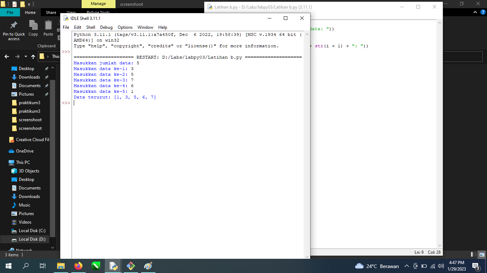
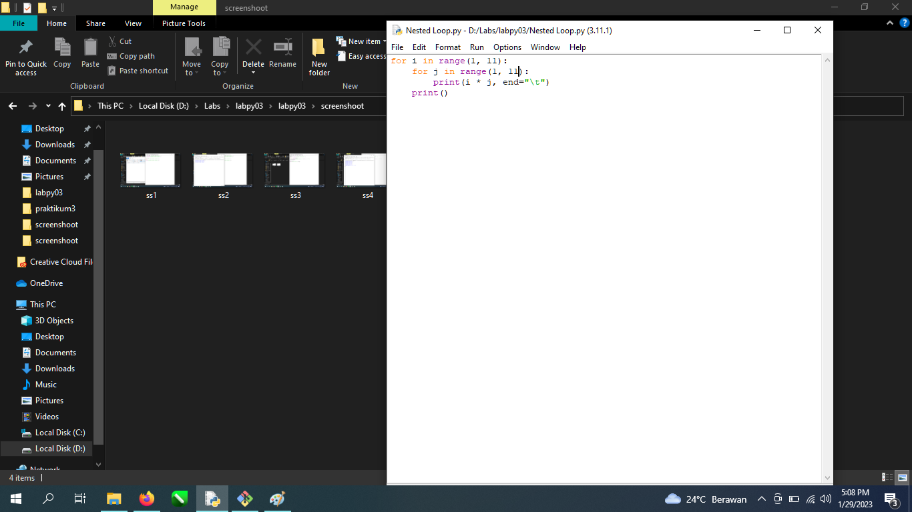
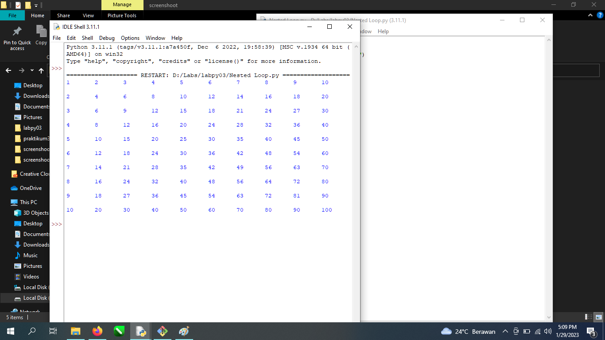
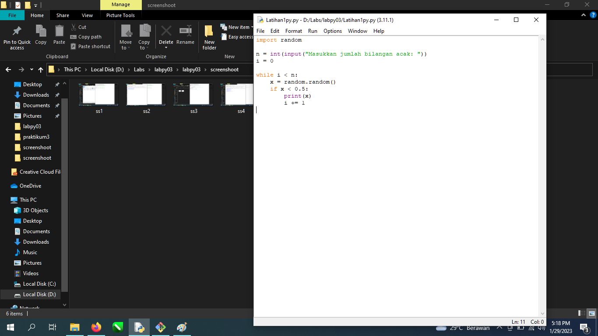
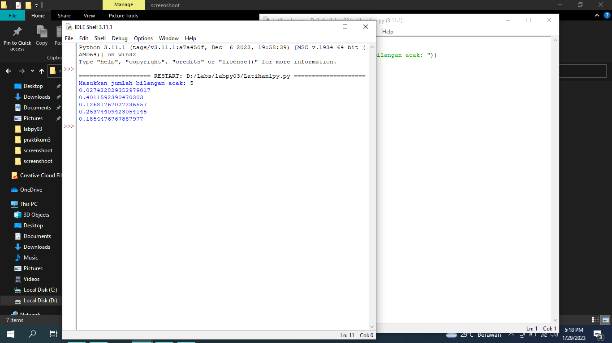
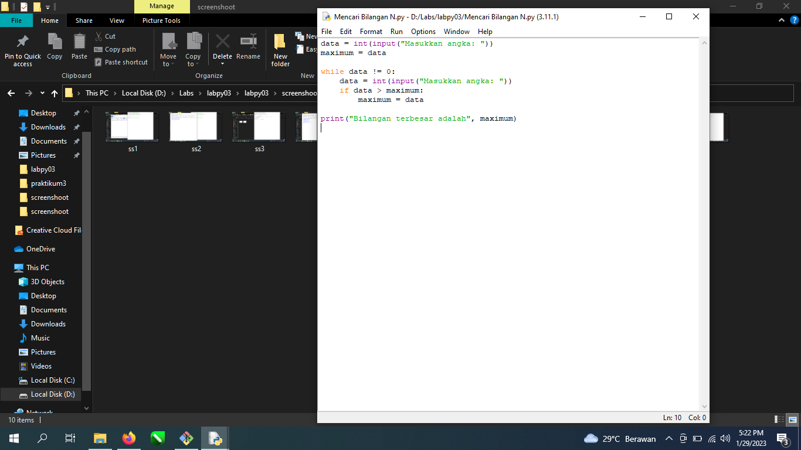
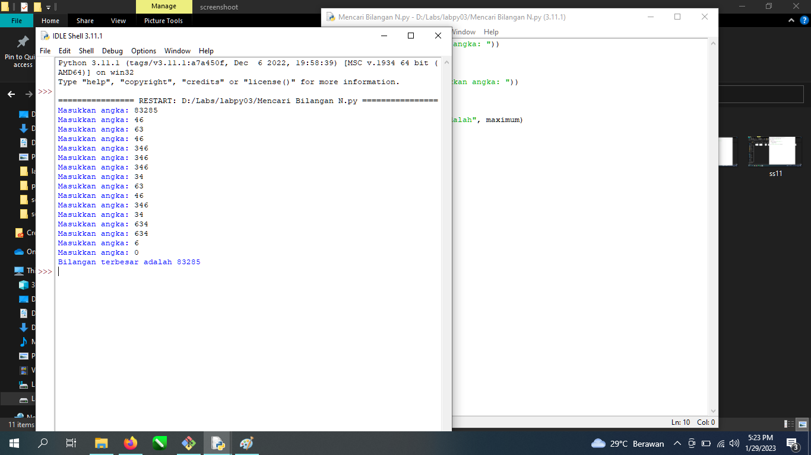
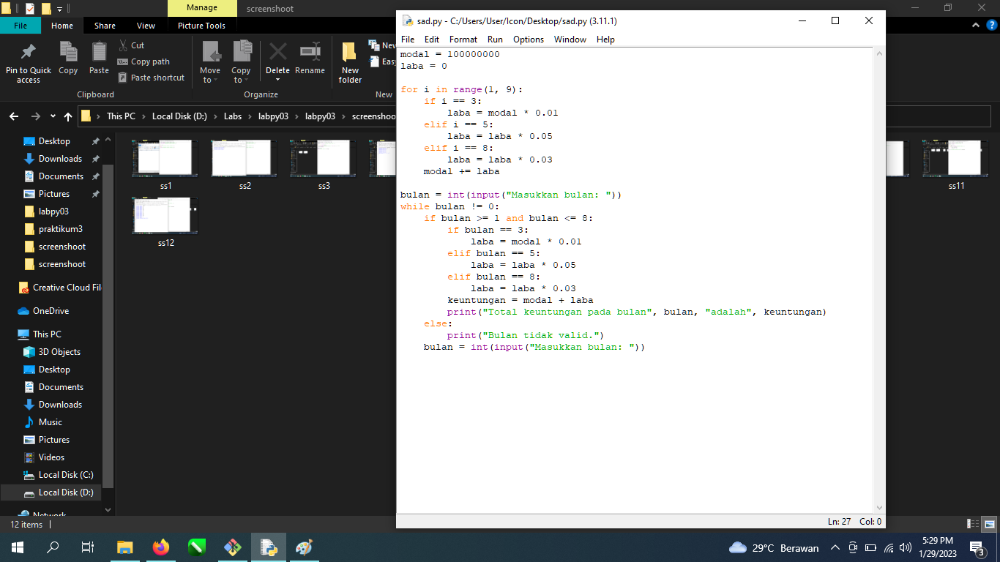
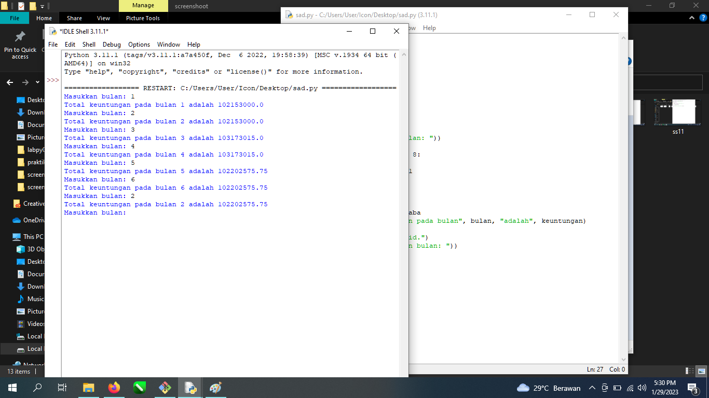

# labpy03

# Latihan Modul Kondisional dan Perulangan
Latihan 1.a : Menentukan Nilai Terbesar dari 2 bilangan Menggunakan statemant If, dengan mengetikan kode :

Lalu input angka pertama misal : 5 dan angka ke 2 : 7 maka hasilnya akan muncul

Latihan 2.a : Mengurutkan Data Berdasarkan input jumlah data dan menampilkan hasilnya secara berurutan mulai dari terkecil hingga terbesar, dengan mengetikan kode :

Masukan Jumlah data yang anda butuhkan, misal 5 maka akan meninput 5 saja, contoh :

Latihan 1.b : Membuat Program Perulangan bertingkat (Nested Loop), dengan mengetikan kode :

maka otomatis akan muncul :

Latihan 2.b : Mencari Bilangan Acak lebih kecil dari 0,5, dengan mengetikan kode :

maka otomatis muncul :

# Latihan Modul Praktikum

# Latihan1py
Latihan 1: latihan1.py
1.Tampilkan n bilangan acak yang lebih kecil dari 0.5.
2.Nilai n diisi pada saat runtime
3.Anda bisa menggunakan kombinasi while dan for untuk menyelesaikannya
4.Gunakan fungsi random() yang dapat diimport terlebih dahulu
Dibawah ini menggunakan fungsi random dan kombinasi while dan for :

Maka akan muncul untuk input bilangan misal : 5, Hasilnya :

# Latihan2py
Latihan 2: latihan2.py
Buat program untuk menampilkan bilangan terbesar dari n buah data yang diinputkan. Masukkan angka 0 untuk berhenti.
Masukan kode berikut ini :

Maka Nanti diminta untuk menginput angka sebanyak banyaknya, bila ingin berhenti ketikkan 0 :

# Latihan3py
Latihan 3: latihan3.py
Seorang pengusaha menginvestasikan uangnya untuk memulai usahanya dengan modal awal 100 juta, pada bulan pertama dan kedua belum mendapatkan laba. pada bulan ketiga baru mulai mendapatkan laba sebesar 1% dan pada bulan ke 5,pendapatan meningkat 5%, selanjutnya pada bulan ke 8 mengalami penurunan keuntungan sebesar 2%, sehingga laba menjadi 3%. Hitung total keuntungan selama 8 bulan berjalan usahanya.
Menggunakan Metode While & For, Maka ketikkan kode berikut :

Maka akan muncul untuk meng input per bulan dan akan melihat totalnya
